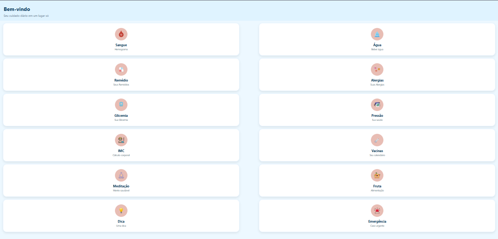

# 🏥 App Saúde - Seu Cuidado Diário em um Só Lugar

O **App Saúde** é uma plataforma desenvolvida para centralizar o gerenciamento do seu bem-estar físico e mental. Com uma interface limpa, intuitiva e dividida em módulos, o aplicativo ajuda o usuário a monitorar indicadores vitais, criar hábitos saudáveis e armazenar informações médicas importantes de forma simples e rápida.

---

## 🚀 Funcionalidades Principais

O aplicativo conta com um painel completo de ferramentas para o seu cuidado diário:

*   **🩸 Sangue (Hemograma):** Registro e acompanhamento de exames de sangue e taxas laboratoriais.
*   **💧 Água:** Monitoramento de hidratação diária com metas personalizadas e lembretes para beber água.
*   **💊 Remédio:** Gerenciador de medicamentos com alarmes, dosagens e horários configuráveis.
*   **🚫 Alergias:** Histórico e catálogo de alergias alimentares, medicamentosas ou sazonais para rápida consulta em emergências.
*   **🩸 Glicemia:** Controle dos níveis de açúcar no sangue, ideal para o acompanhamento de usuários diabéticos ou pré-diabéticos.
*   **🩺 Pressão:** Registro periódico da pressão arterial com gráficos de evolução.
*   **⚖️ IMC (Cálculo Corporal):** Calculadora de Índice de Massa Corporal que ajuda a monitorar o peso ideal.
*   **💉 Vacinas:** Carteira de vacinação digital para acompanhar o seu calendário de imunização.
*   **🧘 Meditação:** Sessões guiadas e temporizadores voltados para a saúde mental e redução do estresse.
*   **🍎 Fruta (Alimentação):** Diário alimentar focado no consumo de alimentos saudáveis e nutrientes essenciais.
*   **💡 Dica:** Pílulas diárias de conhecimento sobre nutrição, exercícios e hábitos saudáveis.
*   **🚨 Emergência:** Botão de acesso rápido para contatos de emergência e exibição de dados médicos vitais na tela de bloqueio.

---

## 🎨 Interface do Usuário

A tela inicial foi projetada para oferecer máxima legibilidade e organização em formato de *cards* dinâmicos:

---
